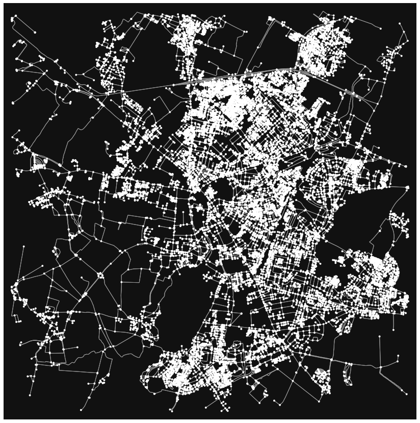
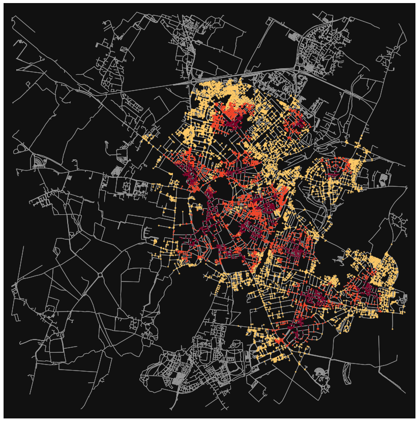
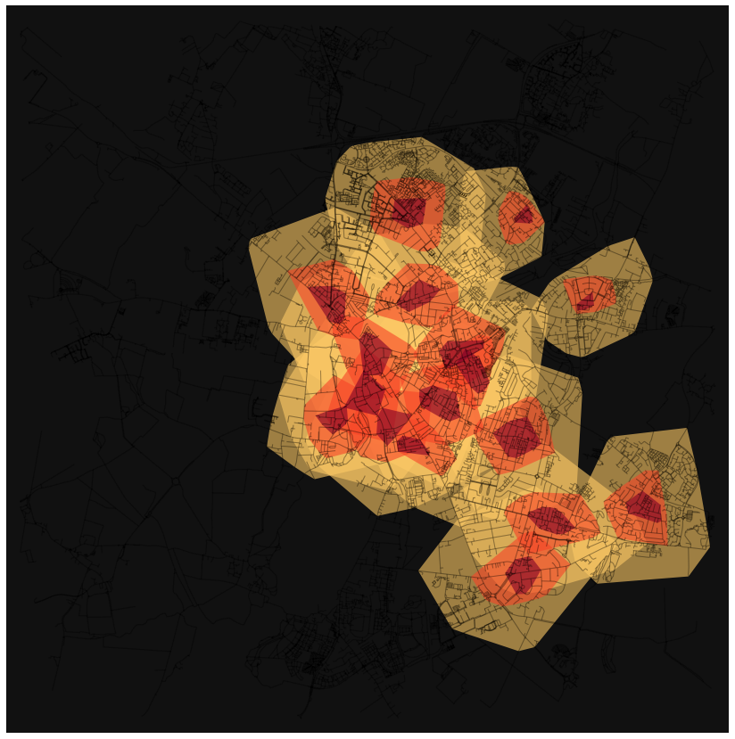
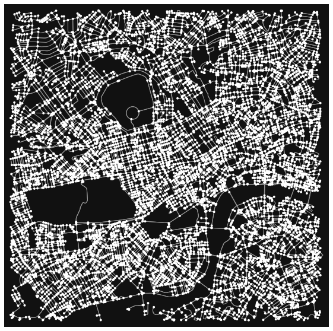
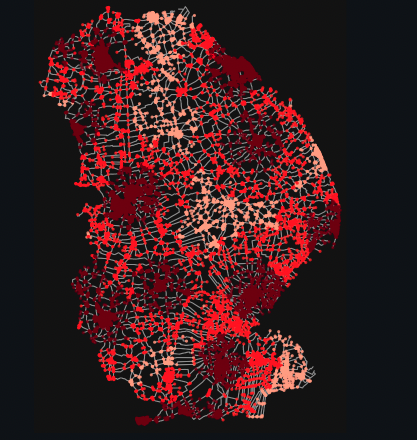
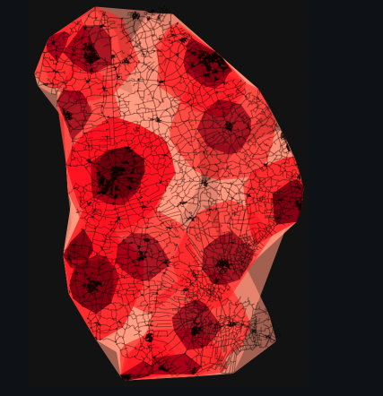
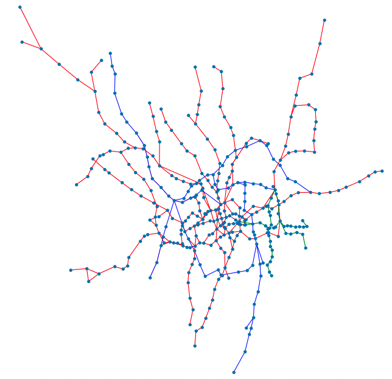
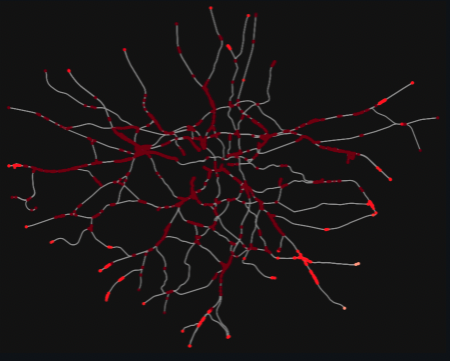

 

## Travel time to NHS organisations

This work was led by [Mattia Ficarelli](https://github.com/mattia-ficarelli), Data Engineer, and [Paul Carroll](https://github.com/pauliecarroll), Senior Data Scientist, as part of their roles with the Analytics Unit of the NHS Transformation Directorate.

The following page and accompanying [GitHub repository](https://github.com/nhsx/nhs_time_of_travel) contain the initial proof of concept and exploratory analysis for the design of a holistic and interactive mapping tool to support decision-making in health and social care.

A mapping tool could support national and regional commissioning strategies by facilitating the placement of new services and the reconfiguration of existing ones. It could also contribute to the NHS agenda for tackling health inequalities by enabling evidence-based decision-making by providing insight on how the availability of health and social care services is influenced by sociodemographic factors.

Using open-source software and publicly accessible datasets we calculate the travel time, with different modes of transport, to varying NHS healthcare services in London and Cambridge. We highlight the challenges of estimating accurate travel times and possible approaches to overcome these. 

Data sources: [NHS Digital](https://digital.nhs.uk/services/organisation-data-service/file-downloads/gp-and-gp-practice-related-data), [Uber Movement](https://movement.uber.com/)

  <h3 class="nhsuk-warning-callout__label">
    Data Quality:
  </h3>
  
Work in progress. 
  

### Walking time to GP practices in Cambridge

The code for this section of the project can be found [here](https://github.com/nhsx/nhs_time_of_travel/blob/main/walking_gp_practice_cambridge.ipynb).

Cambridge was selected as a case city to explore the walking distance to GP practices due to its relatively small size and because central Cambridge is well defined by the CB1, CB2, CB3, CB4, and CB5 postcodes (highlighted in blue in the Cambridge postcode map). The currently active GP practices within the central Cambridge postcode areas were extracted from the [EPRACCUR dataset](https://digital.nhs.uk/services/organisation-data-service/file-downloads/gp-and-gp-practice-related-data), which contains data for general Medical Practices supplied by the NHS Prescription Services and published by NHS Digital.

Using the [GeoPy library](https://geopy.readthedocs.io/en/stable/#) and the [Nominatim API](https://nominatim.org/) the coordinates for the central Cambridge GP practices were identified from GP Practice postcodes. GeoPy allows for the use of multiple different geolocation services, including Google Maps and Bing Maps. Nominatim was selected as it is free to use (limited to a maximum of 1 request per second) and because it is integrated with OpenStreetMap. Due to its usage limits, Nominatim is not suitable for heavy use and does not support systematic queries. Before using Nominatim please read its [usage policy](https://operations.osmfoundation.org/policies/nominatim/).

The [Folium library](https://python-visualization.github.io/folium/) was used to map the GP practices in central Cambridge using their coordinates. Click on an individual marker for the GP practice name, code, address, and contact information.

  <iframe width= "455" height="455"  src="images/folium/cambridge_postcode_map.html" style="border:none;"></iframe>
  &nbsp; &nbsp;
  <iframe width= "455" height="455"  src="images/folium/cambridge_map_no_travel.html" style="border:none;"></iframe>

  <a class="nhsuk-action-link__link" href="data/cambridge_gp_practices.csv">
    <svg class="nhsuk-icon nhsuk-icon__arrow-right-circle" xmlns="http://www.w3.org/2000/svg" viewBox="0 0 24 24" aria-hidden="true">
      <path d="M0 0h24v24H0z" fill="none"></path>
      <path d="M12 2a10 10 0 0 0-9.95 9h11.64L9.74 7.05a1 1 0 0 1 1.41-1.41l5.66 5.65a1 1 0 0 1 0 1.42l-5.66 5.65a1 1 0 0 1-1.41 0 1 1 0 0 1 0-1.41L13.69 13H2.05A10 10 0 1 0 12 2z"></path>
    </svg>
    Download the Cambridge GP practice dataset (.csv)
  </a>

Determining areas which have poor access to health and social care services could inform new service placement strategies. Isochrones are areas on a map accessible from a point within a certain time threshold. Using the [OSMnx library](https://osmnx.readthedocs.io/en/stable/) we aimed to determine the areas of central Cambridge (isochrones ) which were 5 minutes, 10 minutes, and 20 minutes walking distance from any of the central Cambridge GP practices.

OSMnx is a Python package that lets you download geospatial data from [OpenStreetMap](https://www.openstreetmap.org/) and model, project, visualise and analyse real-world street networks and any other geospatial geometries, including walkable, drivable, or bikeable urban networks. A network is a collection of connected objects. The objects in a network are called nodes (or vertices) and are visualised as points. The connections between nodes are called edges and are drawn as lines.  OSMnx networks are topologically corrected, directed, and preserve one-way directionality.

Walkable urban networks represent all the streets and paths that pedestrians can use (ignoring one-way directionality). We created a graph of the walkable urban network 5000 meters from a point arbitrarily defined as the centre of Cambridge (Figure on the left).

OSMnx can determine the node within a network that is closest to a given set of coordinates. Using this functionality, we added the location of all the GP practices in central Cambridge to the OSMnx Cambridge walkable urban network. While useful, this can be inaccurate. To read more about the possible issues that can arise from, and the solutions to, the inaccuracy of mapping coordinates to an OSMnx network node see [here](https://nathanrooy.github.io/posts/2021-03-12/osmnx-openstreetmap-taxicab-routing/). The GP practice nodes were specified as points of interest - where the time of travel starts. 

We specified the walking speed in our analysis to be 4.5 km/hr. By dividing the length of the edge (distance between two nodes) by the walking speed we calculated the time it would take to walk the distance of the edge, adding this as a new attribute 'time' to each edge in the network. This allowed us to determine which nodes in the Cambridge walkable urban network were 5-, 10-, and 20-minutes walking distance from the GP practice nodes. Nodes 5 minutes walking distance from a GP practice were coloured in dark red, while those 10 minutes and 20 minutes away were coloured in orange and yellow respectively (Figure on the right).

  
  &nbsp; &nbsp;
  

[GeoPandas](https://geopandas.org/en/stable/) combines the capabilities of pandas and shapely, providing geospatial operations in pandas and a high-level interface to multiple geometries to shapely, facilitating geospatial data manipulation in python. Using the [NetworkX](https://networkx.org/documentation/stable/index.html) and GeoPandas libraries one can create isochrone polygons from the isochrone network graph, allowing isochrones to be better visualised (Figure on the left). Put simply, nodes for each of the travel times are extracted as point clouds and polygon convex hulls are generated. However, a limitation of this approach is that by generating polygon convex hull geometries detail is lost, and inaccessible areas within isochrones are ignored. Alternative approaches and detailed methods on how to generate isochrones from network graphs are explored [here](http://kuanbutts.com/2017/12/16/osmnx-isochrones/).

OSMnx does not have a native function to plot isochrones with Folium base maps. However, you can create a Geodataframe from isochrones polygons with Geopandas and export the isochrones as geoJSON files. Using this approach, we generated three isochrone GeoJSON files representing the areas 5 minutes, 10 minutes, and 20 minutes walking distance from any of the central Cambridge GP practices and added them to an interactive Folium map (Figure on the right). 

  
  &nbsp; &nbsp;
  <iframe width= "455" height="455"  src="images/folium/cambridge_map_travel.html" style="border:none;"></iframe>

### Driving time between a GP Practice and a Hospital in central London

The code for this section of the project can be found [here](https://github.com/nhsx/nhs_time_of_travel/blob/main/driving_hospital_london.ipynb)

A major challenge when estimating accurate travel times is accounting for the multitude of factors that impact vehicle speed during a journey. Free-flow speed is defined as the average speed of vehicles on a given segment, measured under low-volume conditions – usually close to the speed limit of a given street. However, in major cities such as London free-flow speed is rarely, if ever, achieved by a vehicle during a trip, especially during rush hour. OpenStreetMap does not contain any traffic information, and therefore while travel time information can be calculated using OSMnx it assumes free-flow conditions. As a result, travel times for most trips would be underestimated.

In this section of the project, we explored combining [Uber Movement](https://movement.uber.com/) data with OSMnx to determine a better estimate of the fastest route between a GP Practice and a Hospital in central London. Uber movement consists of billions of pieces of Uber trip data, including datasets measuring zone-to-zone travel times and information on street speeds across a city for Ubers. The data is publicly accessible and can be downloaded in CSV format. 

For our analyses, we used the Uber Movement travel speed data. The data can either be downloaded as a summary of an entire quarter, with speeds on a given road segment provided by the hour of the day, aggregated from all days in the specified quarter, or a monthly dataset can be used which provides the average speed on a given road segment for each hour of each day in the specified month. In our analysis, we used the most recent quarterly speed statistic dataset (Q1 2020). The Uber Movement data does not cover all source and destination pairs for each time interval and includes only road segments with at least 5 unique trips in a quarter resulting in data gaps. Currently, Uber Movement data is available only for selected cities. In the UK, zone-to-zone travel time data is available for London, Leeds, Birmingham, and Bristol while travel speed data is only available for London. 

We decided to conduct exploratory analyses on the route and trip time between St. John’s Wood Medical Practice and St. Thomas Hospital, as any route between them would need to cross central London which is severely impacted by traffic. We generated an OSMnx drivable urban network for the section of central London where the hospital and GP practice are located (Figure on the left). As in the previous section, using their coordinates the GP practice and hospital were mapped to their nearest node within the driveable network.

The OSMnx library contains a built-in shortest-path function which allows you to find the shortest path between any two nodes in a network. You can weight the shortest-path function using different edge attributes. Uber Movement speed data is indexed by OpenStreetMap way ID and OSMnx retains the OpenStreetMap way ID for each edge in the network as an attribute. This allows for the Uber Movement speed data to be appended to each edge as a new attribute. If no Uber Movement speeds were available for a given edge in the network, free-flow speed was appended (which assumes that the speed along an edge is the speed limit of the street). As we were interested in exploring the impact of traffic data on the predicted shortest route between two locations, the Uber Movement speeds at 6 pm (peak London rush hour) were used. This cut of the Uber Movement dataset can be downloaded from this webpage in CSV format. 

The travel time for each edge can be calculated and appended as a new edge attribute by dividing the length of the edge by the speed. Travel time was used to weight the shortest path function, translating to the predicted fastest route between St. John’s Wood Medical Practice and St. Thomas Hospital. The shortest path using both free-flow travel time and Uber-weighted travel was calculated, with both routes visualised on a interactive Folium map (Figure on the right). The OSMnx driveable urban network for this region of central London is also added as layer on the map. 

  
  &nbsp; &nbsp;
  <iframe width= "455" height="455"  src="images/folium/route_map.html" style="border:none;"></iframe>

The statistics for the free-flow and Uber-weighted fastest routes between St. John’s Wood Medical Practice and St. Thomas Hospital are summarized in a table (Table below). At 6 pm the Uber-weighted route differs significantly from the free-flow route, highlighting the impact of traffic on the fastest route between two locations in central London. The free-flow route is slightly longer than the Uber-weighted route. While longer, assuming free-flow speeds this route is quicker than the Uber-weighted route as it involves driving through Park Lane (on the edge of Hyde park) which in 2020 had a speed limit of 40 mph (almost all other streets in central London have a speed limit of 20 mph).  As a result of the gaps in the Uber Movement dataset, only 51% of the edges in the Uber-weighted route had corresponding Uber Movement datapoints. Therefore, the estimated travel time for this route (~ 13 min 40 seconds) is still likely a significant underestimation of the actual travel time at 6 pm. 

  <iframe width= "960" src="images/folium/plotly_table.html" style="border:none;"></iframe>

Estimating accurate travel times using open-source tools and data is challenging due to the lack of available travel time and speed data. Examples of paid-for alternatives include the [Google Maps API](https://developers.google.com/maps) and [Otonomo](https://otonomo.io/traffic-data/). 

  <a class="nhsuk-action-link__link" href="data/uber_movement_speeds_6pm.csv">
    <svg class="nhsuk-icon nhsuk-icon__arrow-right-circle" xmlns="http://www.w3.org/2000/svg" viewBox="0 0 24 24" aria-hidden="true">
      <path d="M0 0h24v24H0z" fill="none"></path>
      <path d="M12 2a10 10 0 0 0-9.95 9h11.64L9.74 7.05a1 1 0 0 1 1.41-1.41l5.66 5.65a1 1 0 0 1 0 1.42l-5.66 5.65a1 1 0 0 1-1.41 0 1 1 0 0 1 0-1.41L13.69 13H2.05A10 10 0 1 0 12 2z"></path>
    </svg>
    Download the Uber Movement dataset (.csv)
  </a>

### Search Functionality as a Layer for Isochrone Maps

The code for this section of the project can be found [here](https://github.com/nhsx/nhs_time_of_travel/blob/main/a%26e.ipynb)

When trying to compare available services and prospective travel times, it is sometimes not easy to find certain health services from the publicly available datasets. This part of the project takes an example of 24 hour A & E services in one of the largest counties in England. It purely focuses on driving times, so excludes the air ambulance. The manual search I used in this part of the project was to ascertain where the locations for the next level of care in the county may be. In this case, Urgent Care Centres, layered on 24 hour A & E services.

Using a googleCP api key, the user can search for anything in google maps, and the code in this notebook extracts the name and latitude and longitude from this search. The example shown uses a publicly available dataset, found  [here](https://www.nhs.uk/about-us/nhs-website-datasets/hospital.csv), but the first search could be done using the search functionality, and this repeated to put a second layer of data in the mapping functionality. 

Once again, this project uses OSMnx in a similar way to the Cambridge GP project. But here the transport mode selected is 'drive', giving driving times at the selected speed across the network selected, in this case Lincolnshire. I specified the driving speed to be 60 km/hr, and selected 10, 20 and 30 minute driving distances. 

The two interactive folium maps below show the 24 hour A & E locations, and in the second map, the Urgent Care Centres on top of the 24 hour A & E services. 

  <iframe width= "455" height="455"  src="images/folium/lincolnshire_a&e.html" style="border:none;"></iframe>
  &nbsp; &nbsp;
  <iframe width= "455" height="455"  src="images/folium/lincolnshire_services.html" style="border:none;"></iframe>

Adding the isochromes to the services and county map shows the following distributions; nodes and isochromes maps:

  
  &nbsp; &nbsp;
  

The final interactive folium map shows the results of the workbook. Four 24 hour A & E services overlayed on the 12 Urgent Care Centres. 

  <iframe width= "455" height="455"  src="images/folium/lincolnshire_services_traveltimes.html" style="border:none;"></iframe>
  &nbsp; &nbsp;

### London Transport network maps and GP Surgeries

The code for this section of the project can be found [here]https://github.com/nhsx/nhs_time_of_travel/blob/main/tube_gp.ipynb)

This part of the project remains unfinished. The idea here was be able to plot a travel time from a London Transport transit point (Underground, Overground or DLR) to a London GP practice. This involved several datasets; London Transport transit nodes and edges, A GP practice dataset for London, and a dataset I found online, which listed the travel times from station to station for the London Underground network, available [here](https://www.whatdotheyknow.com/request/station_to_station_journey_times). 

This involved using networkx, and the nodes and edges functionality therein, alongside latitude and longitude data to correctly plot the London Underground, Overground and DLR maps. Added to this dataset were the travel times between stations. 

OSMnx was used slightly differently here than before. There is a custom travel mode with which you can ask OMSnx to search routes such as 'railway', or 'rail|tram'. This is very useful when looking into urban areas where mass transit may be more popular than both walking or driving. 

  
  &nbsp; &nbsp;
  

Folium was used to identify GP practices in London, the same functionality as used in the Cambridge GP and Lincolnshire A&E services parts of this project. Given the location is London, the output is hugely more clustered representing patient demand in the Capital.

  <iframe width= "455" height="455"  src="images/folium/london_gp.html" style="border:none;"></iframe>
  &nbsp; &nbsp;

The last part of the workbook focuses on the path functionality, in particular the shortest path between stations. Currently the user is able to enter two stations, A & B, within the network, and the function will retrieve the route, the path length, the number of stops, and will give advice on the the lines needed to get from A to B. In the two examples shown, St Johns Wood to Cockfosters is one, and the second, Warren Street to Victoria. This function uses the networkx shortest_path functionality.

## Citations

Boeing, G. 2017. [OSMnx: New Methods for Acquiring, Constructing, Analyzing, and Visualizing Complex Street Networks.](https://geoffboeing.com/publications/osmnx-complex-street-networks/)<i>Computers, Environment and Urban Systems</i> 65, 126-139. doi:10.1016/j.compenvurbsys.2017.05.004

## About this page

This page is built using end-to-end open source analytical tools including: [The NHS Digital Service Manual](https://service-manual.nhs.uk/), [python](https://nhs-pycom.net/), [OSMnx](https://osmnx.readthedocs.io/en/stable/), [plotly](https://plotly.com/python/), [folium](http://python-visualization.github.io/folium/), [GeoPy](https://geopy.readthedocs.io/en/stable/), [beautiful soup](https://www.crummy.com/software/BeautifulSoup/), [pandas](https://pandas.pydata.org/docs/), [GeoPandas](https://geopandas.org/en/stable/), [NetworkX](https://networkx.org/documentation/stable/index.html), [geojson](https://python-geojson.readthedocs.io/en/latest/), [github.io](https://pages.github.com/), and [github actions](https://github.com/features/actions).

  <a class="nhsuk-action-link__link" href="https://github.com/nhsx/open-analytics-template">
    <svg class="nhsuk-icon nhsuk-icon__arrow-right-circle" xmlns="http://www.w3.org/2000/svg" viewBox="0 0 24 24" aria-hidden="true">
      <path d="M0 0h24v24H0z" fill="none"></path>
      <path d="M12 2a10 10 0 0 0-9.95 9h11.64L9.74 7.05a1 1 0 0 1 1.41-1.41l5.66 5.65a1 1 0 0 1 0 1.42l-5.66 5.65a1 1 0 0 1-1.41 0 1 1 0 0 1 0-1.41L13.69 13H2.05A10 10 0 1 0 12 2z"></path>
    </svg>
    Find out how to build your own open analytics pipeline
  </a>

If you have any suggestions or questions, email: <a href="mailto:mattia.ficarelli@nhsx.nhs.uk">mattia.ficarelli@nhsx.nhs.uk</a> or <a href="mailto:paul.carroll@nhsx.nhs.uk">paul.carroll@nhsx.nhs.uk</a>

