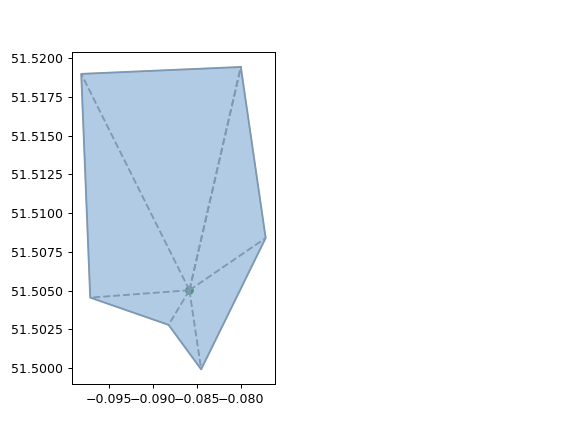
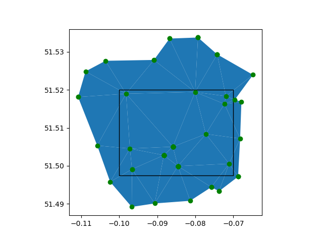

# GP Areas for the purpose of travel time

The code in `gp.py` allows the ability to calculate travel times in a sharded manner, to aid efficient processing.

## The concepts

To do this we introduce the follow concepts:

- Practice: a particular GP practice, which has a geographic location. This location might be the same as another
  location - in fact this is common as GP Surgeries often share the same Health Centre with the same address.
- Location: a latitude, longitude pair. This is usually represented as a pair
  (longitude, latitude) as this enables more conventional (X,Y) plotting
- Triangulation. This is a
  [Delaunay triagulation](https://en.wikipedia.org/wiki/Delaunay_triangulation)
  where the points are the set of distinct locations for the locations of GP practices. Each corner of a triangle is a
  location of one or more practices.
- Triangle: when we say Triangle, we will mean a triangle in the above triangulation
- Catchment area: This is a polygon around each GP practice. It is formed by joining together all the triangles in the
  triangulation which have the location of the Gp practice at a corner. This means the corners are other nearby GP
  practices
    - This means catchment areas for GP practices overlap.
    - Every point (except the practices themselves) is in the catchment areas for 3 locations. These are the 3 GP
      locations forming the corners for the surrounding Triangle of the point in the triangulation



Produced by:

```python
from nhstravel.gp import GpArea, GpRegion
from matplotlib import pyplot as plt

practice_name = "lambeth"
area = GpRegion.load_england()
gp_df = area.find_practices("lambeth")
gp_area = area.get_practice_area(gp_df.index[0])
gp_area.pretty_plot()
plt.savefig('lambeth_walk_area.png')
```

## How to work with a larger areas

Normally you will want travel distances for an area bigger than just one GP catchment area. This requires calculating
one smaller area at a time, then joining the results.

Two approaches were considered:

- By Triangle \[Currently used\]
- By Catchment area \[Worth trying\]

### By Triangle

The algorithm for by triangle would be:

- find all triangles overlapping the area you want to cover
  
- for each triangle:
  - choose a Triangle
  - get the 3 Locations at the corners
  - get all triangles which touch any of those locations
  - download the map for that wider area of all triangles (in case best travel route goes outside the triangle) -
    essentially 3 catchment areas
  - for every node in the triangle, calculate minimum travel distance to any of the corners
  - build the equidistant polygons from those values within the triangle

### By Catchment area

The algorithm for by Catchment area is:

- find all Locations with catchment areas which overlap the given area
- for each Location
  - calculate the travel times polygons for that location within the catchment area
- then for each triangle
  - find the 3 catchment areas which contain that triangle
  - intersect the polygons from the catchment areas with the triangle, then intersect these with each other to find
    polygons for the triangle

In both algorithms you achieve polygons sharded at a triangle level.

Code for area above:

```python
from matplotlib import pyplot as plt
from nhstravel.gp import GpRegion
from shapely import geometry

area = GpRegion.load_england()
poly = geometry.Polygon([[-0.1, 51.52], [-0.07, 51.52], [-0.07, 51.4975], [-0.1, 51.4975], [-0.1, 51.52]])
subregion = area.get_subregion(poly)
subregion.pretty_plot(poly=poly)
plt.savefig('lambeth_subregion.png')
```